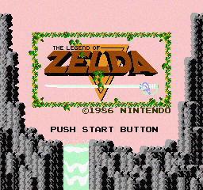
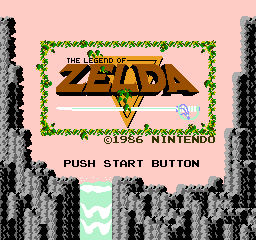

# Dynamic least significant b it PNG steganography encoder / decoder

Util lib to store your favorite texts inside your favorite images.

Example:

Using one of the best title screens of all time (256x240 resolution), I took
one of my favorite public domain books (The Metamorphosis by F. Kafka) and stored it in the color channels:


### Output: `output.png` (with hidden text)


Original image:
### Input: `test.png`


Encoded message is the entire [The Metamorphosis](https://en.wikipedia.org/wiki/The_Metamorphosis) content, a total of ~1M bits.

The png has three parts that has to be read in order:

1. First 4 bits: the number of bits to use in each color channel. This is stored using only 1 bit of each color.
2. Next 64 bits stores an `uint` with the total size of the content (which is zipped).
3. The next `n` bits (from the previous step) is the zipped content.

This ensures the minimum amount of bits used per color channel.

## Improvement ideas

1. Heterogenous usage of bit depth across the image (darker and high variance areas are less sensitive).
2. Use the entire image, (`bit plane` approach rather than per pixel with fixed depth).

## To run

The semantically great names `test.png` and `kafka.txt` are used for image and message source.

```sh
nim -r main.nim
```

